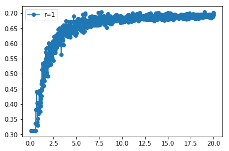
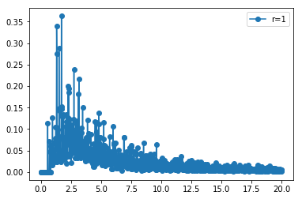

```python
'''
This is the script that uses the codes in folders Applications, etc. to
calculate a physical value. For example The goal is to calculae the residual entropy:
    1) Create a lattice => Lattice Constructor
    2) Initialize it : assign a spins (a discrete field) to each vertex. => Applications
    3) Evolve (classical) the system in imaginary time (temperature) =>  Simulator
    4) Collect the observables such as energy, polarization, etc. => Applications
    
    5)* plot the raw data by writing your own plotting scripts.
    
    
    ** These codes use numpy package ; pyplot and panda are not required but used 
    in this script for plotting, etc. **
    
'''

############## External modules:
import matplotlib.pyplot as plt
import numpy as np
import pandas as pd


############## Internal modules:
from Applications.initialize import initialize
from Applications.getEnergy import getEnergy
from Simulator.evolveInTemp import evolveInTemp
from Applications.getTotalPolarization import getTotalPolarization
from Applications.getEntropyFromHC import getEntropyFromHC
from LatticeConstructor.buildLattice import buildLattice
from Applications.getEntropyFromE import getEntropyFromE


```


```python
#########################  inputs
#
#  construct the lattice here:
#
N1 = 10
N2 = 10
neigb_cutOff = 1 # max rank of neighbor: 
                 # 1 nn only, 2 nn and nnn only etc.
theta_factor = 3 #
alpha = np.pi/theta_factor
a1 = 1
a2 = 1
w0 = 1
power = 3
#
# inputs regarding the Hamilt
#
J = 1 # exchange/dipolar coupling
H = 0.0  # external field
#
# inputs regarding the Temps and the temp steps
# for 10 -> 0.2, 10; 15 -> 
T_min = 0.001
T_max = 20                  #int(0.2*N1*N2) # 40
num_T = 1000 
print 'Maximum Temperature and number of steps:  T_max = ', T_max , '  num_T = ', num_T

dT = (T_max - T_min)/(num_T + 0.0)
Temps = np.array([ T_min + t*dT for t in range(num_T) ])
Temps = list(Temps[::-1])
Betas = 1./np.array(Temps)


#
# The simulation part' inputs: Monte Carlo specifics
#
num_warmup = 100
num_sampling = 20 #*N1*N2
num_mc = 10
#
# This can be removed from this script, but is number realization to use 
# "num_real". Averaging helps to smooth the output curves.
#
num_realizations = 1

## seed
seed_master = 1021

########################
#print neigb_cutOff


########################## Output of the simulation and aplications:
E_vs_T = np.zeros([len(Temps), 2])
E2_vs_T = np.zeros([len(Temps), 2])
P_vs_T = np.zeros([len(Temps), 2])
P2_vs_T = np.zeros([len(Temps), 2])
HC_T = np.zeros([len(Temps), 2])
Ssp_T = np.zeros([len(Temps), 2])
num_moves_T=np.zeros([len(Temps), 2])


## load a number of realizations:
SEEDs = np.loadtxt('randomSeeds_masterSEED_%d.txt'%seed_master)
SEEDs=np.array(SEEDs[:num_realizations], dtype=int)
#print SEEDs
```

    Maximum Temperature and number of steps:  T_max =  20   num_T =  1000


```python

# build lattice 
w_clean, n_clean = buildLattice(N1, N2, alpha, neigb_cutOff,
                                a1, 
                                a2,                  
                                w0, 
                                power)
print '\n\n    lattice is built ! ********   '
for r  in range(len(SEEDs)):
#SEED = 1243
    #print '===================  r= ', r
    SEED = SEEDs[r]
    np.random.seed( SEED )
    
    
    
    lattice = np.zeros([N1, N2])
    
    # initialize random
    initialize(lattice)
    # must use neighbs and weight now
    E_int  = getEnergy(lattice, n_clean, w_clean, J, H)
    P_int =  getTotalPolarization(lattice)
    print '\n\n    ******** Energy and polarization of the initial lattice:',   E_int, P_int

    num_moves = 0
    #
    for Temp in Temps:
        ## warm-up
        E_int, P_int, num_moves = evolveInTemp(lattice, n_clean, w_clean, Temp,J, H,
                                     num_moves,
                                    E_int, P_int, num_warmup)
        ################ sampling
        # energy
        energy_avg=[]
        energy_avg.append(E_int)
        # energy ^ 2
        energy2_avg=[]
        energy2_avg.append(E_int*E_int)
        # polarization
        polarization_avg=[]
        polarization_avg.append(P_int)    
        # polarization ^ 2
        polarization2_avg=[]
        polarization2_avg.append(P_int*P_int)      
        
        for s in range(num_sampling):
            E_int, P_int, num_moves = evolveInTemp(lattice, n_clean, w_clean, Temp,J,  H, 
                                        num_moves,
                                        E_int, P_int, num_mc)
            ## sampling
            # energy
            energy_avg.append(E_int)
            # energy ^ 2
            energy2_avg.append(E_int*E_int)
            # polarization
            polarization_avg.append(P_int)    
            # polarization ^ 2
            polarization2_avg.append(P_int*P_int)  
        
        ### record and average
        E_avg = np.average(energy_avg)
        E_vs_T[Temps.index(Temp), 0] = Temp
        E_vs_T[Temps.index(Temp), 1] += E_avg /(N1*N2 + 0.0)/(len(SEEDs)+0.0)
        
        E2_avg = np.average(energy2_avg)
        E2_vs_T[Temps.index(Temp), 0] = Temp
        E2_vs_T[Temps.index(Temp), 1] += E2_avg/((N1*N2 + 0.0)**2)/(len(SEEDs)+0.0)
        
        P_avg = np.average(polarization_avg)
        P_vs_T[Temps.index(Temp), 0] = Temp
        P_vs_T[Temps.index(Temp), 1] += P_avg/(N1*N2 + 0.0)/(len(SEEDs)+0.0)
        
        P2_avg = np.average(polarization2_avg)
        P2_vs_T[Temps.index(Temp), 0] = Temp
        P2_vs_T[Temps.index(Temp), 1] += P2_avg/((N1*N2 + 0.0)**2)/(len(SEEDs)+0.0)
        
        HC = -(E_avg**2 - E2_avg)/(N1*N2 + 0.0)/(Temp**2)
        HC_T[Temps.index(Temp), 0] = Temp
        HC_T[Temps.index(Temp), 1] += HC/(len(SEEDs)+0.0)
        
        Ssp= -(P_avg**2 - P2_avg)/(N1*N2 + 0.0)/(Temp)
        Ssp_T[Temps.index(Temp), 0] = Temp
        Ssp_T[Temps.index(Temp), 1] += Ssp/(len(SEEDs)+0.0)
        
        num_moves_T[Temps.index(Temp), 0] = Temp
        num_moves_T[Temps.index(Temp), 1] += num_moves /(len(SEEDs)+0.0)
```

    
    
        lattice is built ! ********   
    
    
        ******** Energy and polarization of the initial lattice: 44.0 -4.0


```python
    
######################## entropy 
S_T = getEntropyFromE(E_vs_T)
print 'The lowest 10 entropy values [temperature, entropy]:\n '
print S_T[-10:-1]  ### print the last few S 
```

    The lowest 10 entropy values [temperature, entropy]:
     
    [[ 0.220989    0.31263402]
     [ 0.20099     0.31263402]
     [ 0.180991    0.31263402]
     [ 0.160992    0.31263402]
     [ 0.140993    0.31263402]
     [ 0.120994    0.31263402]
     [ 0.100995    0.31263402]
     [ 0.080996    0.31263402]
     [ 0.060997    0.31263402]]


```python


########################### plot some of the oututs 
#plt.plot(Temps, q, '--')
#plt.plot(E_vs_T[:, 0], E_vs_T[:, 1], '-o')
##plt.plot(E2_vs_T[:, 0], E2_vs_T[:, 1], '-o')
#plt.plot(P_vs_T[:, 0], P_vs_T[:, 1], '-o')
#plt.plot(P2_vs_T[:, 0], P2_vs_T[:, 1], '-o')
#plt.plot(Ssp_T[:, 0],Ssp_T [:, 1], '-o')
#plt.plot(HC_T[:, 0],HC_T[:, 1], '-o')

plt.plot(S_T[-10000:-1, 0],S_T [-10000:-1, 1], '-o', label='r=%d'%(r+1))
plt.legend()

plt.show()
```





```python
########################### plot some of the oututs 
#plt.plot(Temps, q, '--')
#plt.plot(E_vs_T[:, 0], E_vs_T[:, 1], '-o')
##plt.plot(E2_vs_T[:, 0], E2_vs_T[:, 1], '-o')
#plt.plot(P_vs_T[:, 0], P_vs_T[:, 1], '-o')
#plt.plot(P2_vs_T[:, 0], P2_vs_T[:, 1], '-o')
#plt.plot(Ssp_T[:, 0],Ssp_T [:, 1], '-o')

plt.plot(HC_T[:, 0],HC_T[:, 1], '-o', label='r=%d'%(r+1))

#plt.plot(S_T[-10000:-1, 0],S_T [-10000:-1, 1], '-o', label='r=%d'%(r+1))
plt.legend()

plt.show()
```




